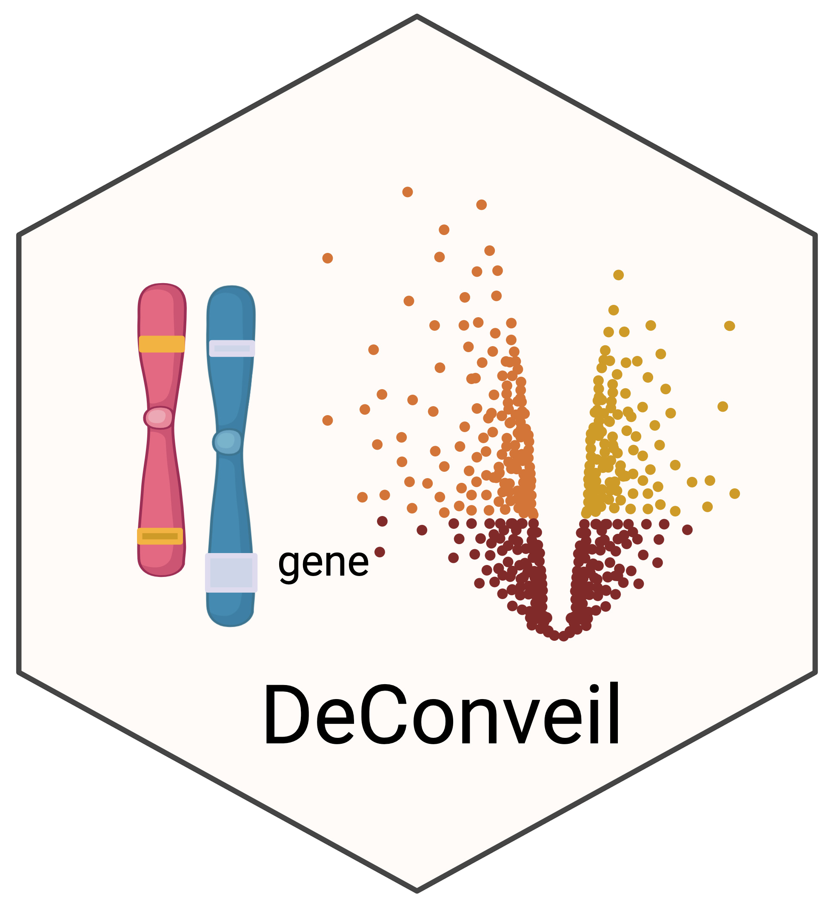

# DeConveil 

#

## Introduction

The goal of *DeConveil* is the extension of Differential Gene Expression (DGE) testing by accounting for genome aneuploidy.
This computational framework extends traditional DGE analysis by integrating DNA Copy Number Variation (CNV) data.
This approach adjusts for dosage effects and categorizes genes as *dosage-sensitive (DSG)*, *dosage-insensitive (DIG)*, and *dosage-compensated (DCG)*, separating the expression changes caused by CNVs from other alterations in transcriptional regulation.
To perform this gene separation we need to carry out DGE testing using both *PyDESeq2 (CN-naive)* and *DeConveil (CN-aware)* methods.

In addition to the core *DeConveil* framework, the package also provides a complementary *Negative Binomial (NB) regression model*, which can be used independently as an alternative inference and analysis strategy.

You can download the results of our analysis from [deconveilCaseStudies](https://github.com/kdavydzenka/deconveilCaseStudies)

## Inference methods

*DeConveil* provides two complementary approaches for modeling gene expression in the presence of genome aneuploidy.

### 1) Core DeConveil framework (default)

The main *DeConveil* framework extends *DESeq2/PyDESeq2* by incorporating copy-number information.
This approach is designed for standard DGE analysis while accounting for dosage-dependent effects and is the default and recommended workflow.

### 2) Complementary Negative Binomial regression (Stan-based)

*DeConveil* also implements a complementary *NB regression model*, implemented in Stan and accessed via `cmdstanpy`.
This model is applied only to tumor samples and is designed to test dosage sensitivity and dosage compensation by directly modeling the relationship between gene expression and CNV.

The Stan-based NB regression can be used independently of the core *DeConveil* pipeline and is intended for users who want:
- a focused analysis of dosage-dependent expression in tumor samples;
- Bayesian inference
- explicit uncertainty quantification

The Stan-based NB regression is optional and does not affect the core *DeConveil* workflow.

## Installation

**Pre-required installations before running DeConveil**

### Python dependencies

Python libraries required for the core *DeConveil* framework include `pydeseq2`

`pip install pydeseq2`

`DeConveil` can be installed from PyPI using `pip`:

`pip install deconveil`

`DeConveil` can also be installed from Bioconda with `conda`:

`conda install -c bioconda deconveil`

### R dependencies (required)

*DeConveil* relies on the R package `stageR` (via `rpy2`) for stage-wise multiple testing and FDR control.
A working `R` installation and the `stageR` package are required.
The package can be installed from Bioconductor:

`BiocManager::install("stageR")`

### Optional Stan support

The complementary NB regression requires the Python package `cmdstanpy` and a working installation of `CmdStan`.
To enable Stan support, install DeConveil with the stan extra:

`pip install "deconveil[stan]"`

Then install CmdStan:

`python -m cmdstanpy.install_cmdstan`

If Stan support is not installed, the core DeConveil framework remains fully functional.

## Data

**Input data**

DeConveil requires the following input matrices: 

    - matched mRNA read counts (normal and tumor samples) and absolute CN values (for normal diploid samples we assign CN=2), structured as NxG matrix, where N represents the number of samples and G represents the number of genes;
    
    - a design matrix structured as an N × F matrix, where N is the number of samples and F is the number of features or covariates.
    
Example of CN data for a given gene *g*:
CN = [1, 2, 3, 4, 5, 6].

An example of the input data can be found in the *test_deconveil* Jupyter Notebook.

**Output data**

`res_CNnaive.csv` (for *PyDESeq2* method) and `res_CNaware.csv` (for *DeConveil*) data frames reporting *log2FC* and *p.adjust* values for both methods.

These data frames are further processed to separate gene groups using `define_gene_groups()` function included in DeConveil framework.

A tutorial of the analysis workflow is available in `test_deconveil.ipynb`

### Citation

If you use `DeConveil`, cite:

Davydzenka K, Caravagna G, Sanguinetti G (2026) Extending differential gene expression testing to handle genome aneuploidy in cancer. PLoS Comput Biol 22(3): e1014134. https://doi.org/10.1371/journal.pcbi.1014134

### Copyright and contacts

Katsiaryna Davydzenka, Cancer Data Science (CDS) Laboratory.

